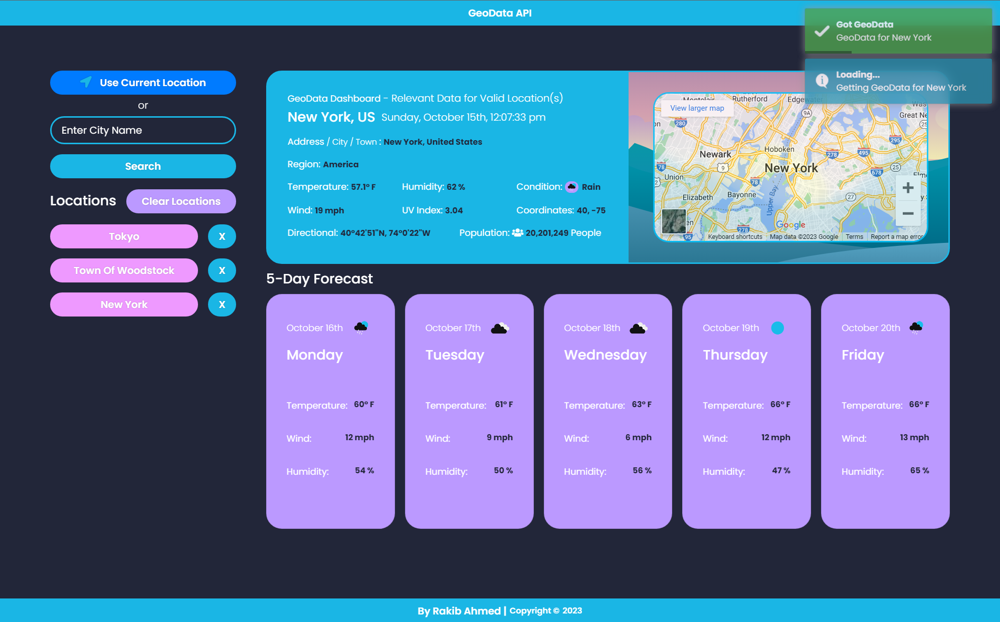
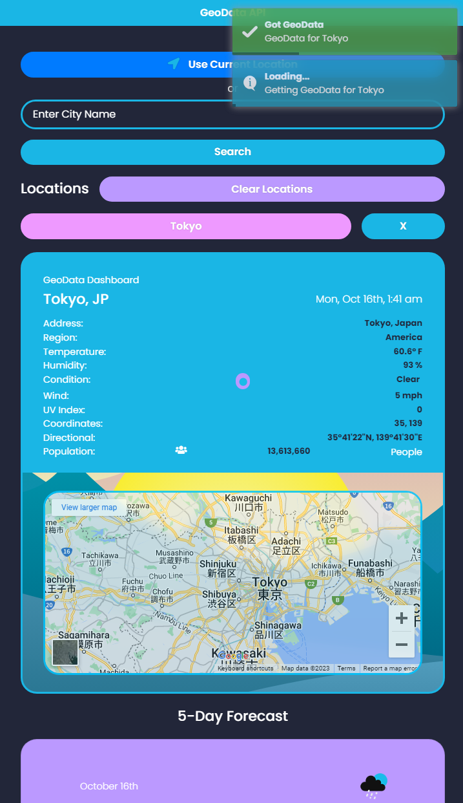

# GeoData API
## Application Design
Desktop                    |                    Mobile
:-------------------------:|:-------------------------:
  |  

## Application Function
GeoData API
You can view the Relevant Geo Data such as Location, Timezone, Weather, etc. for any valid location in the world.

## Application Link
https://strawhat19.github.io/Weather-App/